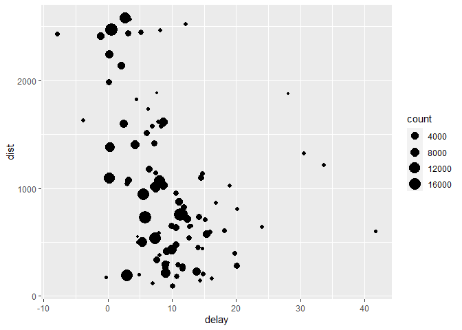

Chapter\_5\_R4DS
================

## R Markdown

``` r
rm(list=ls())
library(nycflights13)
```

    ## Warning: package 'nycflights13' was built under R version 4.1.2

``` r
library(tidyverse)
```

    ## Warning: package 'tidyverse' was built under R version 4.1.2

    ## -- Attaching packages --------------------------------------- tidyverse 1.3.1 --

    ## v ggplot2 3.3.5     v purrr   0.3.4
    ## v tibble  3.1.6     v dplyr   1.0.8
    ## v tidyr   1.2.0     v stringr 1.4.0
    ## v readr   2.1.2     v forcats 0.5.1

    ## Warning: package 'ggplot2' was built under R version 4.1.2

    ## Warning: package 'tibble' was built under R version 4.1.2

    ## Warning: package 'tidyr' was built under R version 4.1.2

    ## Warning: package 'purrr' was built under R version 4.1.2

    ## Warning: package 'dplyr' was built under R version 4.1.2

    ## Warning: package 'stringr' was built under R version 4.1.2

    ## Warning: package 'forcats' was built under R version 4.1.2

    ## -- Conflicts ------------------------------------------ tidyverse_conflicts() --
    ## x dplyr::filter() masks stats::filter()
    ## x dplyr::lag()    masks stats::lag()

``` r
data = nycflights13::flights
##
```

\#\#5.2.4 EXERCISES \#\#\#\#1. Find all flights that - Had an arrival
delay of two or more hours - Flew to Houston (IAH or HOU) - Were
operated by United, American, or Delta - Departed in summer (July,
August, and September) - Arrived more than two hours late, but didn’t
leave late - Were delayed by at least an hour, but made up over 30
minutes in flight - Departed between midnight and 6am (inclusive)

``` r
prob1 = data[data$arr_delay >= 120,]
prob2 = data[data$dest == 'IAH' | data$dest == 'HOU',]

prob3 = data[data$carrier == 'AA' | data$carrier == 'UA' | data$carrier == 'DL',]
prob3b = data[data$carrier %in% c("AA","UA","DL"),]

prob4 = data[data$month %in% c(7,8,9),]
prob4b = data[data$month == 7 | data$month == 8 | data$month == 9,]

prob5 = data[data$arr_delay > 120 & data$dep_delay <= 0,]

prob6 = data[data$dep_delay > 60 & data$dep_time - data$arr_time >= 30,]
head(data)
```

    ## # A tibble: 6 x 19
    ##    year month   day dep_time sched_dep_time dep_delay arr_time sched_arr_time
    ##   <int> <int> <int>    <int>          <int>     <dbl>    <int>          <int>
    ## 1  2013     1     1      517            515         2      830            819
    ## 2  2013     1     1      533            529         4      850            830
    ## 3  2013     1     1      542            540         2      923            850
    ## 4  2013     1     1      544            545        -1     1004           1022
    ## 5  2013     1     1      554            600        -6      812            837
    ## 6  2013     1     1      554            558        -4      740            728
    ## # ... with 11 more variables: arr_delay <dbl>, carrier <chr>, flight <int>,
    ## #   tailnum <chr>, origin <chr>, dest <chr>, air_time <dbl>, distance <dbl>,
    ## #   hour <dbl>, minute <dbl>, time_hour <dttm>

``` r
prob7 = data[data$dep_time >= 2400 | data$dep_time <= 600,]
```

### 2 Another useful dplyr filtering helper is between(). What does it do? Can you use it to simplify the code needed to answer the previous challenges?

``` r
prob2= data[between(data$dep_time,2400,600),]
#no you cant use it.
```

### 3 How many flights have a missing dep\_time? What other variables are missing? What might these rows represent?

``` r
prob3 = colSums(is.na(data))
#8255, another variables are dep_delay,arr_time and so on
```

### 4 Why is NA ^ 0 not missing? Why is NA \| TRUE not missing? Why is FALSE & NA not missing? Can you figure out the general rule? (NA \* 0 is a tricky counterexample!)

``` r
#these are operations that have the same output for every possible value.
```

\#\#EXERCISES 5.3.1

### 1 How could you use arrange() to sort all missing values to the start? (Hint: use is.na()).

``` r
prob1 = data %>% filter(is.na(dep_time)) %>% arrange(dep_time)
```

### 2 Sort flights to find the most delayed flights. Find the flights that left earliest.

``` r
prob2= data %>% arrange(min_rank(dep_delay))
```

### 3 Sort flights to find the fastest (highest speed) flights.

``` r
prob3 = data %>% arrange(-air_time)
```

### 4 Which flights travelled the farthest? Which travelled the shortest?

``` r
prob4 = data %>% group_by(flight) %>% select(distance, flight, everything()) %>% arrange(-distance)
prob4b = data %>%arrange(desc(air_time)) %>% select(air_time,everything())
```

### 1 Brainstorm as many ways as possible to select dep\_time, dep\_delay, arr\_time, and arr\_delay from flights

``` r
#many ways 
prob1 = data[,names(data) == c("dep_time", "dep_delay", "arr_time", "arr_delay")]
```

    ## Warning in names(data) == c("dep_time", "dep_delay", "arr_time", "arr_delay"):
    ## comprimento do objeto maior não é múltiplo do comprimento do objeto menor

``` r
prob1b = data %>% select(dep_time,dep_delay,arr_time,arr_delay)
prob1c = data[,c(4,6,7,9)]
prob1d = data %>% select(contains(c('time', 'delay')))
```

### 2 What happens if you include the name of a variable multiple times in a select() call?

``` r
data %>% select(arr_time, arr_time, arr_time)
```

    ## # A tibble: 336,776 x 1
    ##    arr_time
    ##       <int>
    ##  1      830
    ##  2      850
    ##  3      923
    ##  4     1004
    ##  5      812
    ##  6      740
    ##  7      913
    ##  8      709
    ##  9      838
    ## 10      753
    ## # ... with 336,766 more rows

``` r
#only works once.
```

### 3 What does the any\_of() function do? Why might it be helpful in conjunction with this vector?

``` r
vars <- c("year", "month", "day", "dep_delay", "arr_delay")
data %>% select(any_of(vars))
```

    ## # A tibble: 336,776 x 5
    ##     year month   day dep_delay arr_delay
    ##    <int> <int> <int>     <dbl>     <dbl>
    ##  1  2013     1     1         2        11
    ##  2  2013     1     1         4        20
    ##  3  2013     1     1         2        33
    ##  4  2013     1     1        -1       -18
    ##  5  2013     1     1        -6       -25
    ##  6  2013     1     1        -4        12
    ##  7  2013     1     1        -5        19
    ##  8  2013     1     1        -3       -14
    ##  9  2013     1     1        -3        -8
    ## 10  2013     1     1        -2         8
    ## # ... with 336,766 more rows

``` r
# it select all the variables the match the name in the variable.
```

### 4 Does the result of running the following code surprise you? How do the select helpers deal with case by default? How can you change that default?

``` r
ex4 = data %>% select(dplyr::contains("TIME"))

#yes, i thought it was case sensitive, but it isnt.
```

### 5.5.2 Exercises

### 1 Currently dep\_time and sched\_dep\_time are convenient to look at, but hard to compute with because they’re not really continuous numbers. Convert them to a more convenient representation of number of minutes since midnight.

``` r
ex1 = data %>% mutate (hour_deptime = dep_time %/% 100, minute_dep_time = dep_time %% 100) %>% select(hour_deptime, minute_dep_time,everything())

ex2 = data %>% mutate (hour_sch_deptime = sched_dep_time %/% 100, minute_sch_dep_time = sched_dep_time %% 100) %>% select(hour_sch_deptime, minute_sch_dep_time, everything())
```

### 2Compare air\_time with arr\_time - dep\_time. What do you expect to see? What do you see? What do you need to do to fix it?

``` r
ex1 =  data %>% select(air_time, arr_time, dep_time) %>%  mutate(arr_time-dep_time, arr_min = (arr_time %/% 100)*60 + (arr_time %% 100),dep_min = (dep_time %/% 100)*60 + (dep_time %% 100), trip_min = arr_min - dep_min)
ex1
```

    ## # A tibble: 336,776 x 7
    ##    air_time arr_time dep_time `arr_time - dep_time` arr_min dep_min trip_min
    ##       <dbl>    <int>    <int>                 <int>   <dbl>   <dbl>    <dbl>
    ##  1      227      830      517                   313     510     317      193
    ##  2      227      850      533                   317     530     333      197
    ##  3      160      923      542                   381     563     342      221
    ##  4      183     1004      544                   460     604     344      260
    ##  5      116      812      554                   258     492     354      138
    ##  6      150      740      554                   186     460     354      106
    ##  7      158      913      555                   358     553     355      198
    ##  8       53      709      557                   152     429     357       72
    ##  9      140      838      557                   281     518     357      161
    ## 10      138      753      558                   195     473     358      115
    ## # ... with 336,766 more rows

#### 3 Compare dep\_time, sched\_dep\_time, and dep\_delay. How would you expect those three numbers to be related?

dep delay = dep\_time minus sched\_dep\_time as showed below however, we
need to transform data first as shown below, in other words, transform
it to correct hour/min using modulos and remainder operations and then
subtract.

``` r
ex3 = data %>% select(dep_time,sched_dep_time,dep_delay) %>% mutate(delay = dep_time - sched_dep_time, dep_timee_ajs = (dep_time %/% 100)*60 + (dep_time %% 100), sch_dep_time_min = (sched_dep_time %/% 100)*60 + (sched_dep_time %% 100), dep_delayy = dep_timee_ajs - sch_dep_time_min)
```

### 4 Find the 10 most delayed flights using a ranking function. How do you want to handle ties? Carefully read the documentation for min\_rank().

``` r
data
```

    ## # A tibble: 336,776 x 19
    ##     year month   day dep_time sched_dep_time dep_delay arr_time sched_arr_time
    ##    <int> <int> <int>    <int>          <int>     <dbl>    <int>          <int>
    ##  1  2013     1     1      517            515         2      830            819
    ##  2  2013     1     1      533            529         4      850            830
    ##  3  2013     1     1      542            540         2      923            850
    ##  4  2013     1     1      544            545        -1     1004           1022
    ##  5  2013     1     1      554            600        -6      812            837
    ##  6  2013     1     1      554            558        -4      740            728
    ##  7  2013     1     1      555            600        -5      913            854
    ##  8  2013     1     1      557            600        -3      709            723
    ##  9  2013     1     1      557            600        -3      838            846
    ## 10  2013     1     1      558            600        -2      753            745
    ## # ... with 336,766 more rows, and 11 more variables: arr_delay <dbl>,
    ## #   carrier <chr>, flight <int>, tailnum <chr>, origin <chr>, dest <chr>,
    ## #   air_time <dbl>, distance <dbl>, hour <dbl>, minute <dbl>, time_hour <dttm>

``` r
data %>% mutate(rank = min_rank(dep_delay)) %>% arrange(-rank)
```

    ## # A tibble: 336,776 x 20
    ##     year month   day dep_time sched_dep_time dep_delay arr_time sched_arr_time
    ##    <int> <int> <int>    <int>          <int>     <dbl>    <int>          <int>
    ##  1  2013     1     9      641            900      1301     1242           1530
    ##  2  2013     6    15     1432           1935      1137     1607           2120
    ##  3  2013     1    10     1121           1635      1126     1239           1810
    ##  4  2013     9    20     1139           1845      1014     1457           2210
    ##  5  2013     7    22      845           1600      1005     1044           1815
    ##  6  2013     4    10     1100           1900       960     1342           2211
    ##  7  2013     3    17     2321            810       911      135           1020
    ##  8  2013     6    27      959           1900       899     1236           2226
    ##  9  2013     7    22     2257            759       898      121           1026
    ## 10  2013    12     5      756           1700       896     1058           2020
    ## # ... with 336,766 more rows, and 12 more variables: arr_delay <dbl>,
    ## #   carrier <chr>, flight <int>, tailnum <chr>, origin <chr>, dest <chr>,
    ## #   air_time <dbl>, distance <dbl>, hour <dbl>, minute <dbl>, time_hour <dttm>,
    ## #   rank <int>

\#Function min\_rank is used along with mutate so in order to work it
needs to be with mutate. It creates a new variable called rank, so its
possible to rank this new variable and find the most delayed flight or
vice versa.

### 5 What does 1:3 + 1:10 return? Why?

error because in order to sum these kind of object it must to be
multiple.

``` r
1:3 + 1:10
```

    ## Warning in 1:3 + 1:10: comprimento do objeto maior não é múltiplo do comprimento
    ## do objeto menor

    ##  [1]  2  4  6  5  7  9  8 10 12 11

``` r
#something that would work would be:
1:5 + 1:10
```

    ##  [1]  2  4  6  8 10  7  9 11 13 15

### 6 What trigonometric functions does R provide?

### Chart to visualize the amount (count) of delayed flights using distance as parameter.

``` r
delay = data %>% group_by(dest) %>% summarise(count = n(), dist = mean(distance, na.rm = T), delay = mean(arr_delay, na.rm = T)) %>% filter(count > 20, dest != 'HNL')

chart = ggplot(data = delay,aes(x = delay, y = dist)) + geom_point(aes(size = count))
chart
```

<!-- --> \#\#\#
5.6.1 EXERCISES

### 1 Group flights by destination.

``` r
names(data)
```

    ##  [1] "year"           "month"          "day"            "dep_time"      
    ##  [5] "sched_dep_time" "dep_delay"      "arr_time"       "sched_arr_time"
    ##  [9] "arr_delay"      "carrier"        "flight"         "tailnum"       
    ## [13] "origin"         "dest"           "air_time"       "distance"      
    ## [17] "hour"           "minute"         "time_hour"

``` r
ex1 = data %>% group_by(dest) 
ex1
```

    ## # A tibble: 336,776 x 19
    ## # Groups:   dest [105]
    ##     year month   day dep_time sched_dep_time dep_delay arr_time sched_arr_time
    ##    <int> <int> <int>    <int>          <int>     <dbl>    <int>          <int>
    ##  1  2013     1     1      517            515         2      830            819
    ##  2  2013     1     1      533            529         4      850            830
    ##  3  2013     1     1      542            540         2      923            850
    ##  4  2013     1     1      544            545        -1     1004           1022
    ##  5  2013     1     1      554            600        -6      812            837
    ##  6  2013     1     1      554            558        -4      740            728
    ##  7  2013     1     1      555            600        -5      913            854
    ##  8  2013     1     1      557            600        -3      709            723
    ##  9  2013     1     1      557            600        -3      838            846
    ## 10  2013     1     1      558            600        -2      753            745
    ## # ... with 336,766 more rows, and 11 more variables: arr_delay <dbl>,
    ## #   carrier <chr>, flight <int>, tailnum <chr>, origin <chr>, dest <chr>,
    ## #   air_time <dbl>, distance <dbl>, hour <dbl>, minute <dbl>, time_hour <dttm>

### 2 Summarise to compute distance, average delay, and number of flights.

``` r
names(data)
```

    ##  [1] "year"           "month"          "day"            "dep_time"      
    ##  [5] "sched_dep_time" "dep_delay"      "arr_time"       "sched_arr_time"
    ##  [9] "arr_delay"      "carrier"        "flight"         "tailnum"       
    ## [13] "origin"         "dest"           "air_time"       "distance"      
    ## [17] "hour"           "minute"         "time_hour"

``` r
data %>% group_by(dest) %>% summarise(soma_distancia = sum(distance, na.rm = T), 
                                      delay_medio = mean(arr_delay, na.rm = T),
                                      count_na = (sum(!is.na(dep_delay))),
                                      number_of_flights = n()) %>% arrange(-number_of_flights)
```

    ## # A tibble: 105 x 5
    ##    dest  soma_distancia delay_medio count_na number_of_flights
    ##    <chr>          <dbl>       <dbl>    <int>             <int>
    ##  1 ORD         12599321       5.88     16642             17283
    ##  2 ATL         13033618      11.3      16898             17215
    ##  3 LAX         39927498       0.547    16076             16174
    ##  4 BOS          2956398       2.91     15049             15508
    ##  5 MCO         13280883       5.45     13982             14082
    ##  6 CLT          7566816       7.36     13698             14064
    ##  7 SFO         34366299       2.67     13230             13331
    ##  8 FLL         12899679       8.08     11934             12055
    ##  9 MIA         12801727       0.299    11633             11728
    ## 10 DCA          2047815       9.07      9157              9705
    ## # ... with 95 more rows

### 3 selecting only flights who havent got ‘na’ in dep\_delay nor in arr\_delay.

``` r
nao_cancelado <- data %>%
  filter(!is.na(air_time))
nao_cancelado
```

    ## # A tibble: 327,346 x 19
    ##     year month   day dep_time sched_dep_time dep_delay arr_time sched_arr_time
    ##    <int> <int> <int>    <int>          <int>     <dbl>    <int>          <int>
    ##  1  2013     1     1      517            515         2      830            819
    ##  2  2013     1     1      533            529         4      850            830
    ##  3  2013     1     1      542            540         2      923            850
    ##  4  2013     1     1      544            545        -1     1004           1022
    ##  5  2013     1     1      554            600        -6      812            837
    ##  6  2013     1     1      554            558        -4      740            728
    ##  7  2013     1     1      555            600        -5      913            854
    ##  8  2013     1     1      557            600        -3      709            723
    ##  9  2013     1     1      557            600        -3      838            846
    ## 10  2013     1     1      558            600        -2      753            745
    ## # ... with 327,336 more rows, and 11 more variables: arr_delay <dbl>,
    ## #   carrier <chr>, flight <int>, tailnum <chr>, origin <chr>, dest <chr>,
    ## #   air_time <dbl>, distance <dbl>, hour <dbl>, minute <dbl>, time_hour <dttm>

\#\#\#5.6.7 EXERCISES

### Brainstorm at least 5 different ways to assess the typical delay characteristics of a group of flights. Consider the following scenarios:

``` r
nao_cancelado %>% 
  group_by(tailnum) %>% 
  mutate(
    count = n(),
    mediana_atraso_chegada = median(arr_delay),
    mediana_atraso_chegada = median(dep_delay)) %>% 
      filter(count > 5) %>% 
      arrange(mediana_atraso_chegada)
```

    ## # A tibble: 326,189 x 21
    ## # Groups:   tailnum [3,575]
    ##     year month   day dep_time sched_dep_time dep_delay arr_time sched_arr_time
    ##    <int> <int> <int>    <int>          <int>     <dbl>    <int>          <int>
    ##  1  2013    11    11     1138           1148       -10     1323           1404
    ##  2  2013    11    15     1140           1148        -8     1337           1404
    ##  3  2013     7    23     2008           1735       153     2145           1937
    ##  4  2013     8     7     1725           1735       -10     1904           1937
    ##  5  2013     8     9     1127           1136        -9     1316           1338
    ##  6  2013     8    16     1126           1136       -10     1336           1338
    ##  7  2013     1    20      704            725       -21     1025           1035
    ##  8  2013     3     9     1813           1815        -2     2114           2125
    ##  9  2013     3    28      717            725        -8     1004           1030
    ## 10  2013     3    31     1809           1820       -11     2056           2135
    ## # ... with 326,179 more rows, and 13 more variables: arr_delay <dbl>,
    ## #   carrier <chr>, flight <int>, tailnum <chr>, origin <chr>, dest <chr>,
    ## #   air_time <dbl>, distance <dbl>, hour <dbl>, minute <dbl>, time_hour <dttm>,
    ## #   count <int>, mediana_atraso_chegada <dbl>

### 4 Come up with another approach that will give you the same output as not\_cancelled %&gt;% count(dest) and not\_cancelled %&gt;% count(tailnum, wt = distance) (without using count())

``` r
ex1 = data %>% group_by(dest) %>%  summarise(count = n())
ex2 = data %>% group_by(tailnum) %>% summarise(weight = sum(distance))
ex2
```

    ## # A tibble: 4,044 x 2
    ##    tailnum weight
    ##    <chr>    <dbl>
    ##  1 D942DN    3418
    ##  2 N0EGMQ  250866
    ##  3 N10156  115966
    ##  4 N102UW   25722
    ##  5 N103US   24619
    ##  6 N104UW   25157
    ##  7 N10575  150194
    ##  8 N105UW   23618
    ##  9 N107US   21677
    ## 10 N108UW   32070
    ## # ... with 4,034 more rows

### 5.7.1 Exercises

### Which plane (tailnum) has the worst on-time record?

``` r
data %>% group_by(tailnum) %>% summarise(media = round(mean(arr_delay),1)) %>% arrange(- media)
```

    ## # A tibble: 4,044 x 2
    ##    tailnum media
    ##    <chr>   <dbl>
    ##  1 N844MH   320 
    ##  2 N911DA   294 
    ##  3 N922EV   276 
    ##  4 N587NW   264 
    ##  5 N851NW   219 
    ##  6 N928DN   201 
    ##  7 N7715E   188 
    ##  8 N654UA   185 
    ##  9 N665MQ   175.
    ## 10 N427SW   157 
    ## # ... with 4,034 more rows

#### the worst one is N384HA which has got the most the biggest time, however if we compare the mean N844MH is the tailnumber with the largest mean.

### What time of day should you fly if you want to avoid delays as much as possible?

### 

``` r
data %>% group_by(hour) %>% summarise(delay_mediana = median((arr_time - dep_time), na.rm = T)) %>% arrange(+delay_mediana)
```

    ## # A tibble: 20 x 2
    ##     hour delay_mediana
    ##    <dbl>         <dbl>
    ##  1    23         -1920
    ##  2    22            94
    ##  3    21           104
    ##  4    20           172
    ##  5    12           201
    ##  6     6           210
    ##  7    11           211
    ##  8    14           214
    ##  9     8           218
    ## 10    13           219
    ## 11    19           219
    ## 12    10           221
    ## 13    16           222
    ## 14    18           222
    ## 15    15           224
    ## 16    17           248
    ## 17     9           249
    ## 18     7           266
    ## 19     5           284
    ## 20     1            NA

#### Como pode ser observado, tirando um possível outlayer na primeira linhas, as horas com menos delay são as noturnas….

### Find all destinations that are flown by at least two carriers. Use that information to rank the carriers.

``` r
data %>% group_by(dest) %>% summarise(n_carriers = n_distinct(carrier)) %>% filter(n_carriers > 2) %>% arrange(-n_carriers)
```

    ## # A tibble: 52 x 2
    ##    dest  n_carriers
    ##    <chr>      <int>
    ##  1 ATL            7
    ##  2 BOS            7
    ##  3 CLT            7
    ##  4 ORD            7
    ##  5 TPA            7
    ##  6 AUS            6
    ##  7 DCA            6
    ##  8 DTW            6
    ##  9 IAD            6
    ## 10 MSP            6
    ## # ... with 42 more rows

### como pode ser visto ATL tem 7 carriers.
