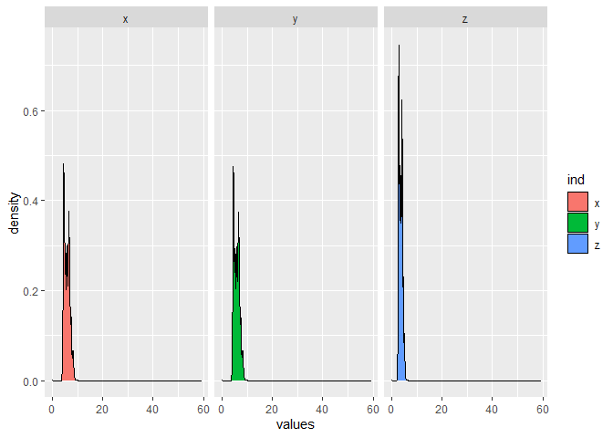
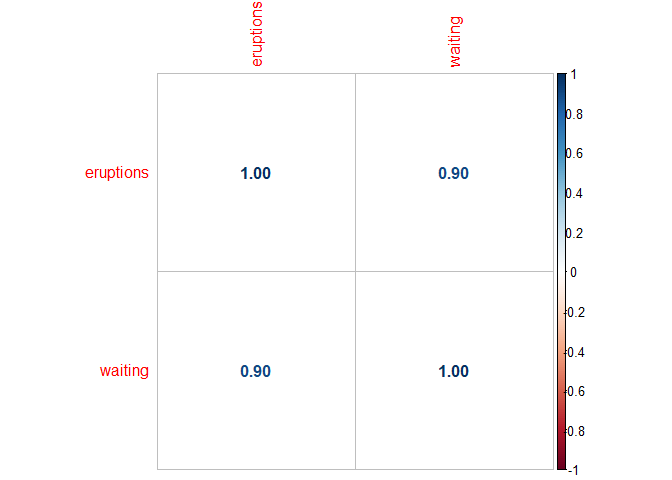

CAPITULO 7
================

\#\#\#\#loading packages

``` r
library(tidyverse)
```

    ## Warning: package 'tidyverse' was built under R version 4.1.2

    ## -- Attaching packages --------------------------------------- tidyverse 1.3.1 --

    ## v ggplot2 3.3.5     v purrr   0.3.4
    ## v tibble  3.1.6     v dplyr   1.0.8
    ## v tidyr   1.2.0     v stringr 1.4.0
    ## v readr   2.1.2     v forcats 0.5.1

    ## Warning: package 'ggplot2' was built under R version 4.1.2

    ## Warning: package 'tibble' was built under R version 4.1.2

    ## Warning: package 'tidyr' was built under R version 4.1.2

    ## Warning: package 'purrr' was built under R version 4.1.2

    ## Warning: package 'dplyr' was built under R version 4.1.2

    ## Warning: package 'stringr' was built under R version 4.1.2

    ## Warning: package 'forcats' was built under R version 4.1.2

    ## -- Conflicts ------------------------------------------ tidyverse_conflicts() --
    ## x dplyr::filter() masks stats::filter()
    ## x dplyr::lag()    masks stats::lag()

``` r
library(corrplot)
```

    ## Warning: package 'corrplot' was built under R version 4.1.3

    ## corrplot 0.92 loaded

``` r
library(modelr)
```

    ## Warning: package 'modelr' was built under R version 4.1.2

#### categorical variable

``` r
diamonds %>% ggplot() + geom_bar(mapping = aes(x = cut))
```

<!-- -->

#### A altura de cada coluna representa quantas observações ocorreram em cada valor, é possível contar esses valores com count()

``` r
diamonds %>% count(cut)
```

    ## # A tibble: 5 x 2
    ##   cut           n
    ##   <ord>     <int>
    ## 1 Fair       1610
    ## 2 Good       4906
    ## 3 Very Good 12082
    ## 4 Premium   13791
    ## 5 Ideal     21551

#### Variável Contínua

#### São variáveis que podem conter qualquer tipo de valores infinitos. Números e datas são exemplos de variáveis continuas.

#### Para avaliar distribuição utiliza-se histograma

``` r
diamonds %>% ggplot() + geom_histogram(mapping = aes(price), bins = 15)
```

<!-- -->

#### em nosso dataset as variáveis contínuas são: Carat,depth,table,price,x,y,z

``` r
head(diamonds)
```

    ## # A tibble: 6 x 10
    ##   carat cut       color clarity depth table price     x     y     z
    ##   <dbl> <ord>     <ord> <ord>   <dbl> <dbl> <int> <dbl> <dbl> <dbl>
    ## 1  0.23 Ideal     E     SI2      61.5    55   326  3.95  3.98  2.43
    ## 2  0.21 Premium   E     SI1      59.8    61   326  3.89  3.84  2.31
    ## 3  0.23 Good      E     VS1      56.9    65   327  4.05  4.07  2.31
    ## 4  0.29 Premium   I     VS2      62.4    58   334  4.2   4.23  2.63
    ## 5  0.31 Good      J     SI2      63.3    58   335  4.34  4.35  2.75
    ## 6  0.24 Very Good J     VVS2     62.8    57   336  3.94  3.96  2.48

``` r
diamonds %>% 
  count(cut_width(carat, 0.5))
```

    ## # A tibble: 11 x 2
    ##    `cut_width(carat, 0.5)`     n
    ##    <fct>                   <int>
    ##  1 [-0.25,0.25]              785
    ##  2 (0.25,0.75]             29498
    ##  3 (0.75,1.25]             15977
    ##  4 (1.25,1.75]              5313
    ##  5 (1.75,2.25]              2002
    ##  6 (2.25,2.75]               322
    ##  7 (2.75,3.25]                32
    ##  8 (3.25,3.75]                 5
    ##  9 (3.75,4.25]                 4
    ## 10 (4.25,4.75]                 1
    ## 11 (4.75,5.25]                 1

#### O geom\_freqpoly pode use ser utilizado como histograma.

``` r
diamonds %>% ggplot() + geom_histogram(mapping = aes(x = price, fill = cut))
```

    ## `stat_bin()` using `bins = 30`. Pick better value with `binwidth`.

<!-- -->

``` r
diamonds %>% ggplot() + geom_freqpoly(mapping = aes(x = carat, color = cut))
```

    ## `stat_bin()` using `bins = 30`. Pick better value with `binwidth`.

<!-- -->

``` r
names(diamonds)
```

    ##  [1] "carat"   "cut"     "color"   "clarity" "depth"   "table"   "price"  
    ##  [8] "x"       "y"       "z"

``` r
diamonds %>% ggplot() + geom_boxplot(mapping = aes(x = cut, y = price, color = cut))
```

<!-- -->

## 7.3.4

#### Explore the distribution of each of the x, y, and z variables in diamonds. What do you learn? \#\#\#\# Think about a diamond and how you might decide which dimension is the length, width, and depth.

``` r
dimensions = diamonds[,c('x','y','z')]
stacked = stack(dimensions)
stacked$ind = as.factor(stacked$ind)
stacked %>% ggplot() + geom_density(mapping = aes(x = values, fill = ind)) + facet_wrap(~ind)
```

<!-- --> \#\#\#
Como podemos ver o X está mais distribuido e o Z mais concentrado,
provavelmente o X apresenta um maior desvio padrão do que Y, podemos
verificar esta hipotse com a tabela abaixo.

``` r
by(stacked$values, stacked$ind, sd)
```

    ## stacked$ind: x
    ## [1] 1.121761
    ## ------------------------------------------------------------ 
    ## stacked$ind: y
    ## [1] 1.142135
    ## ------------------------------------------------------------ 
    ## stacked$ind: z
    ## [1] 0.7056988

### Conforme pode ser visto o desvio padrão de X é maior do que de Z.

#### Explore the distribution of price. Do you discover anything unusual or surprising? (Hint: Carefully think about the binwidth and make sure you try a wide range of values.)

``` r
diamonds
```

    ## # A tibble: 53,940 x 10
    ##    carat cut       color clarity depth table price     x     y     z
    ##    <dbl> <ord>     <ord> <ord>   <dbl> <dbl> <int> <dbl> <dbl> <dbl>
    ##  1  0.23 Ideal     E     SI2      61.5    55   326  3.95  3.98  2.43
    ##  2  0.21 Premium   E     SI1      59.8    61   326  3.89  3.84  2.31
    ##  3  0.23 Good      E     VS1      56.9    65   327  4.05  4.07  2.31
    ##  4  0.29 Premium   I     VS2      62.4    58   334  4.2   4.23  2.63
    ##  5  0.31 Good      J     SI2      63.3    58   335  4.34  4.35  2.75
    ##  6  0.24 Very Good J     VVS2     62.8    57   336  3.94  3.96  2.48
    ##  7  0.24 Very Good I     VVS1     62.3    57   336  3.95  3.98  2.47
    ##  8  0.26 Very Good H     SI1      61.9    55   337  4.07  4.11  2.53
    ##  9  0.22 Fair      E     VS2      65.1    61   337  3.87  3.78  2.49
    ## 10  0.23 Very Good H     VS1      59.4    61   338  4     4.05  2.39
    ## # ... with 53,930 more rows

``` r
diamonds %>% ggplot() + geom_histogram(mapping = aes(x = price),binwidth = 1000, color = 'black', fill = 'grey')
```

<!-- -->

#### Conforme pode ser visto os dados não apresentam distribuição normal, estão mais concentrados em valores menores (positive skeweded).

#### podemos fazer o teste de kolmogorov smirnov

``` r
diamonds$price = as.numeric(diamonds$price)
diamoprice = diamonds[1:4999,]

testekol = shapiro.test(diamoprice$price)
testekol
```

    ## 
    ##  Shapiro-Wilk normality test
    ## 
    ## data:  diamoprice$price
    ## W = 0.66171, p-value < 2.2e-16

``` r
#valor menor do que 0.05 o que confirma a hipotse que os dados não estão distribuidos normal.
```

### how many diamonds are 0.99 carat, how many are 1 carat?

``` r
names(diamonds)
```

    ##  [1] "carat"   "cut"     "color"   "clarity" "depth"   "table"   "price"  
    ##  [8] "x"       "y"       "z"

``` r
diamonds %>% group_by(carat) %>% filter(carat == 0.99 | carat == 1) %>% summarise(n = n()) 
```

    ## # A tibble: 2 x 2
    ##   carat     n
    ##   <dbl> <int>
    ## 1  0.99    23
    ## 2  1     1558

#### removing NA (Not recommended this way)

``` r
diamonds2 = diamonds %>% filter(between(y,3,20))
diamonds2
```

    ## # A tibble: 53,931 x 10
    ##    carat cut       color clarity depth table price     x     y     z
    ##    <dbl> <ord>     <ord> <ord>   <dbl> <dbl> <dbl> <dbl> <dbl> <dbl>
    ##  1  0.23 Ideal     E     SI2      61.5    55   326  3.95  3.98  2.43
    ##  2  0.21 Premium   E     SI1      59.8    61   326  3.89  3.84  2.31
    ##  3  0.23 Good      E     VS1      56.9    65   327  4.05  4.07  2.31
    ##  4  0.29 Premium   I     VS2      62.4    58   334  4.2   4.23  2.63
    ##  5  0.31 Good      J     SI2      63.3    58   335  4.34  4.35  2.75
    ##  6  0.24 Very Good J     VVS2     62.8    57   336  3.94  3.96  2.48
    ##  7  0.24 Very Good I     VVS1     62.3    57   336  3.95  3.98  2.47
    ##  8  0.26 Very Good H     SI1      61.9    55   337  4.07  4.11  2.53
    ##  9  0.22 Fair      E     VS2      65.1    61   337  3.87  3.78  2.49
    ## 10  0.23 Very Good H     VS1      59.4    61   338  4     4.05  2.39
    ## # ... with 53,921 more rows

\#\#\#\#Removing NA (recommended way)

``` r
diamonds2 <- diamonds %>% 
  mutate(y = ifelse(y < 3 | y > 20, NA, y))
colSums(is.na(diamonds2))
```

    ##   carat     cut   color clarity   depth   table   price       x       y       z 
    ##       0       0       0       0       0       0       0       0       9       0

#### 9 values out of the bounds (&lt;3 or &gt;20)

``` r
diamonds2 %>% ggplot() + geom_point(mapping = aes(x = x, y = y))
```

    ## Warning: Removed 9 rows containing missing values (geom_point).

<!-- --> \#\#\#\#
still veriyinf some outliers

``` r
nycflights13::flights %>% 
  mutate(
    cancelled = is.na(dep_time),
    sched_hour = sched_dep_time %/% 100,
    sched_min = sched_dep_time %% 100,
    sched_dep_time = sched_hour + sched_min / 60
  ) %>% 
  ggplot(mapping = aes(sched_dep_time)) + 
    geom_freqpoly(mapping = aes(colour = cancelled), binwidth = 1/4)
```

<!-- -->
\#\#\#\#\# 7.4.1 Exercises

``` r
diamonds2 %>% ggplot() + geom_histogram(mapping = aes(x = y))
```

    ## `stat_bin()` using `bins = 30`. Pick better value with `binwidth`.

    ## Warning: Removed 9 rows containing non-finite values (stat_bin).

<!-- -->
\#\#\#\#\# we can see that when there’s NA value there a space between
bins.

### If variation describes the behavior within a variable, covariation describes the behavior between variables.

``` r
ggplot(data = diamonds, aes(x = price, y = ..density..)) + geom_freqpoly(mapping = aes(color = cut))
```

    ## `stat_bin()` using `bins = 30`. Pick better value with `binwidth`.

<!-- -->

#### another way of doing it

``` r
diamonds %>% ggplot() + geom_density(mapping = aes(x = price, fill = cut), alpha = 0.4)
```

<!-- -->

### data of the chart above are stardardized so its possible to see the differences, otherwise it wouldn’t be that easy.

``` r
diamonds2 %>%  ggplot() + geom_boxplot(mapping = aes(x = cut,y= price))
```

<!-- -->

### What variable in the diamonds dataset is most important for predicting the price of a diamond?

### How is that variable correlated with cut? Why does the combination of those two relationships \#\#\# lead to lower quality diamonds being more expensive?

``` r
diamonds3 = diamonds[,c('carat','depth','table','price','x','y','z')]
corrplot(cor(diamonds3), method  = 'number')
```

<!-- --> \#\#\#\#
as it’s showed w/ price the variables which correlate the most are
carat, x,y,z, for predicting we could use carat, x,y,z

install.packages(‘polycor’) \#\#\#\# as

``` r
diamonds
```

    ## # A tibble: 53,940 x 10
    ##    carat cut       color clarity depth table price     x     y     z
    ##    <dbl> <ord>     <ord> <ord>   <dbl> <dbl> <dbl> <dbl> <dbl> <dbl>
    ##  1  0.23 Ideal     E     SI2      61.5    55   326  3.95  3.98  2.43
    ##  2  0.21 Premium   E     SI1      59.8    61   326  3.89  3.84  2.31
    ##  3  0.23 Good      E     VS1      56.9    65   327  4.05  4.07  2.31
    ##  4  0.29 Premium   I     VS2      62.4    58   334  4.2   4.23  2.63
    ##  5  0.31 Good      J     SI2      63.3    58   335  4.34  4.35  2.75
    ##  6  0.24 Very Good J     VVS2     62.8    57   336  3.94  3.96  2.48
    ##  7  0.24 Very Good I     VVS1     62.3    57   336  3.95  3.98  2.47
    ##  8  0.26 Very Good H     SI1      61.9    55   337  4.07  4.11  2.53
    ##  9  0.22 Fair      E     VS2      65.1    61   337  3.87  3.78  2.49
    ## 10  0.23 Very Good H     VS1      59.4    61   338  4     4.05  2.39
    ## # ... with 53,930 more rows

``` r
diamonds %>% ggplot() + geom_boxplot(mapping = aes(x = cut, y = price))
```

<!-- --> \#\#\#\#
as we can see the plots are overlaping, this shows us that there’s no
strong correlation between price and \#\#\#\# the table below apresents
the mean between cut, note that there’s not much difference between
CUTS, this shows no strong correlation between factors (cut).

``` r
by(diamonds$price,diamonds$cut, mean)
```

    ## diamonds$cut: Fair
    ## [1] 4358.758
    ## ------------------------------------------------------------ 
    ## diamonds$cut: Good
    ## [1] 3928.864
    ## ------------------------------------------------------------ 
    ## diamonds$cut: Very Good
    ## [1] 3981.76
    ## ------------------------------------------------------------ 
    ## diamonds$cut: Premium
    ## [1] 4584.258
    ## ------------------------------------------------------------ 
    ## diamonds$cut: Ideal
    ## [1] 3457.542

#### 7.5.2 two catergorical variables

``` r
library(tidyverse)
ggplot(data = diamonds) + geom_count(mapping = aes(x = cut, y = color))
```

<!-- -->

#### 7.5.2.1 Exercises

##### How could you rescale the count dataset above to more clearly show the distribution of cut \#\#\#\#\# within colour, or colour within cut?

``` r
diamonds %>% group_by(color,cut) %>% summarise(n = n()) %>% arrange(-n)
```

    ## `summarise()` has grouped output by 'color'. You can override using the
    ## `.groups` argument.

    ## # A tibble: 35 x 3
    ## # Groups:   color [7]
    ##    color cut           n
    ##    <ord> <ord>     <int>
    ##  1 G     Ideal      4884
    ##  2 E     Ideal      3903
    ##  3 F     Ideal      3826
    ##  4 H     Ideal      3115
    ##  5 G     Premium    2924
    ##  6 D     Ideal      2834
    ##  7 E     Very Good  2400
    ##  8 H     Premium    2360
    ##  9 E     Premium    2337
    ## 10 F     Premium    2331
    ## # ... with 25 more rows

``` r
library(tidyverse)
diamonds %>% ggplot() + geom_bar(mapping = aes(x = reorder(cut, desc(cut)), fill = color))
```

<!-- -->

``` r
diamonds %>% 
  count(color, cut)
```

    ## # A tibble: 35 x 3
    ##    color cut           n
    ##    <ord> <ord>     <int>
    ##  1 D     Fair        163
    ##  2 D     Good        662
    ##  3 D     Very Good  1513
    ##  4 D     Premium    1603
    ##  5 D     Ideal      2834
    ##  6 E     Fair        224
    ##  7 E     Good        933
    ##  8 E     Very Good  2400
    ##  9 E     Premium    2337
    ## 10 E     Ideal      3903
    ## # ... with 25 more rows

``` r
ggplot(data = diamonds, mapping = aes(x = price)) + 
  geom_boxplot(mapping = aes(group = cut_number(price, 2)))
```

<!-- --> \#\#\#\#
7.6

### relationship between faithful eruptions and waiting

``` r
faithful %>% ggplot() + geom_point(mapping = aes(x = eruptions, y = waiting))
```

<!-- -->

#### as we can see there’s a relationship between eruptions and waiting, let’s check how strong it is

``` r
corrplot(cor(faithful), method  = 'number')
```

<!-- -->

``` r
### or simply
cor(faithful$eruptions,faithful$waiting)
```

    ## [1] 0.9008112

#### the relationship is considered strong r &gt;= 0.7

#### Padrões apresentam uma das ferramentas mais úteis quando se tratando de data science pois eles revelam covariancia. Se você pensa a variancia como sendo um fenomeno que aumenta a incerteza, a covariancia é um fenomeno que a reduz. Se duas variáveis covariam, podemos usar o valor de uma variável para fazer melhores predições sobre os valores da segunda. Se a covariancia é devido a relação-causa podemos então usar o valor de uma variávle para controlar o valor da segunda;

``` r
mod = lm(log(price) ~ log(carat), data = diamonds)

diamonds2 <- diamonds %>% 
  add_residuals(mod) %>% 
  mutate(resid = exp(resid))

ggplot(data = diamonds2) + geom_point(mapping = aes(x = carat, y = resid))
```

<!-- -->

``` r
diamonds2 %>% ggplot() + geom_boxplot(mapping = aes(x = cut, y = resid))
```

<!-- -->
